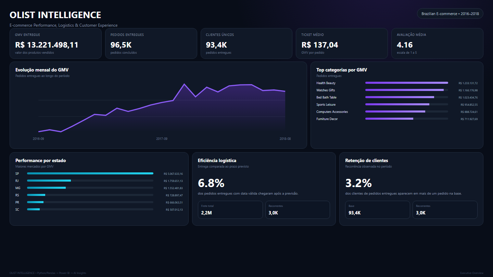
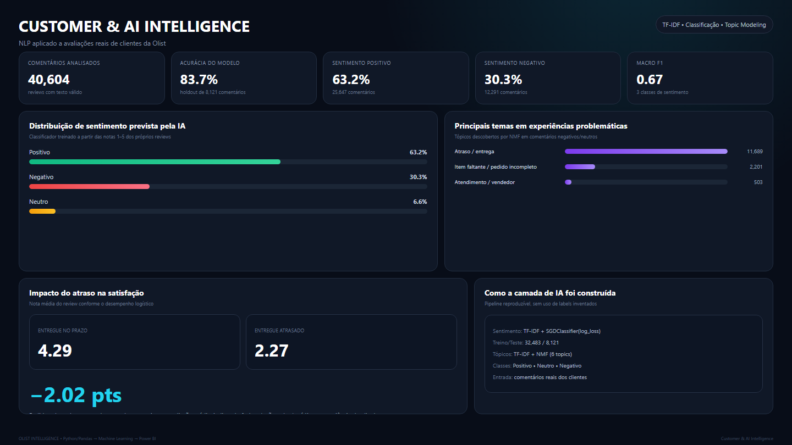

# Olist Intelligence

Projeto de portfólio de **Analytics + Machine Learning + Power BI** construído sobre o Brazilian E-Commerce Public Dataset by Olist.

O objetivo foi transformar dados brutos de e-commerce em um pipeline reproduzível, uma camada analítica confiável, um dashboard executivo e uma análise de experiência do cliente com NLP.





## Resultados principais

- **99.441 pedidos** processados
- **112.650 itens** processados
- **96.096 clientes únicos**
- **32.951 produtos**
- **3.095 vendedores**
- **R$ 13,22 milhões de GMV entregue**
- **96.478 pedidos entregues**
- **R$ 137,04 de ticket médio**
- **4,16 de avaliação média**
- **6,8% de taxa de atraso**
- **303 divergências financeiras** entre 98.665 pedidos comparáveis

## Camada de IA / NLP

Foram analisados **40.604 comentários reais de clientes**.

### Classificação de sentimento

Modelo:

```
TF-IDF
  ↓
SGDClassifier (log-loss)
  ↓
Positivo / Neutro / Negativo
```

Desempenho no conjunto de teste, usando rótulos derivados das notas dos reviews (1–2 negativo, 3 neutro, 4–5 positivo):

- **Acurácia: 83,7%**
- **Macro F1: 0,67**
- **8.121 comentários no holdout**

> Como os rótulos de sentimento são derivados das avaliações numéricas, a métrica mede consistência com esse proxy e não substitui uma validação humana anotada.

Distribuição prevista:

- Positivo: **63,2%**
- Negativo: **30,3%**
- Neutro: **6,6%**

### Topic Modeling

Para avaliações negativas e neutras foi usado:

```
TF-IDF → NMF
```

Os principais grupos encontrados foram relacionados a:

- atraso / entrega;
- item faltante / pedido incompleto;
- atendimento / vendedor.

### Insight de negócio

A avaliação média de pedidos entregues **no prazo** foi de aproximadamente **4,29**.

Para pedidos **atrasados**, caiu para aproximadamente **2,27**.

Isso representa uma diferença de cerca de **2,02 pontos**, indicando forte associação entre desempenho logístico e satisfação do cliente.

## Arquitetura

```
9 CSVs brutos
      ↓
auditoria de dados
      ↓
transformações com Pandas
      ↓
agregações por granularidade
      ↓
┌──────────────────────┬──────────────────────┐
│ orders_analytics     │ items_analytics      │
│ 1 linha = 1 pedido   │ 1 linha = 1 item     │
└──────────────────────┴──────────────────────┘
      ↓
validação de integridade
      ↓
CSV + Parquet
      ↓
Machine Learning / NLP
      ↓
Power BI
```

## Validações implementadas

O pipeline verifica automaticamente:

- unicidade de `order_id`;
- unicidade da chave `order_id + order_item_id`;
- integridade item → pedido;
- conciliação do valor dos produtos;
- conciliação do frete;
- divergências entre pagamento e itens;
- granularidade após merges;
- chaves órfãs;
- nulos e anomalias de pagamento.

## Estrutura

```
olist-intelligence/
├── assets/
├── dashboard/
├── data/
│   ├── raw/
│   ├── processed/
│   └── ai/
├── src/
│   ├── data_audit.py
│   ├── relational_audit.py
│   ├── transform_orders.py
│   ├── transform_order_items.py
│   ├── transform_payments.py
│   ├── transform_reviews.py
│   ├── build_orders_analytics.py
│   ├── build_items_analytics.py
│   ├── ai_review_intelligence.py
│   └── main.py
└── requirements.txt
```

## Como executar

Crie e ative um ambiente virtual e instale as dependências:

```powershell
python -m venv .venv
.\.venv\Scripts\Activate.ps1
python -m pip install -r requirements.txt
```

Execute todo o projeto com um único comando:

```powershell
python src\full_pipeline.py
```

Se preferir executar as etapas separadamente:

```powershell
python src\main.py
python src\ai_review_intelligence.py
```

## Power BI

O repositório inclui o tema visual, as medidas DAX e as imagens finais do dashboard. O arquivo `.pbix` não é versionado porque incorpora dados derivados e aumenta bastante o tamanho do repositório.

Arquivos úteis:

```text
dashboard/olist_intelligence_theme.json
dashboard/measures.dax
dashboard/POWERBI_BUILD_GUIDE.md
```

O modelo utiliza as tabelas `orders`, `items` e `review_ai`, relacionadas por `order_id`.

## Stack

- Python
- Pandas
- NumPy
- Scikit-learn
- TF-IDF
- NMF
- Parquet / PyArrow
- Power BI
- DAX

## Dataset

Brazilian E-Commerce Public Dataset by Olist, disponibilizado publicamente no Kaggle:

https://www.kaggle.com/datasets/olistbr/brazilian-ecommerce

Os CSVs brutos, datasets processados e artefatos analíticos gerados localmente são intencionalmente excluídos do Git. Veja `data/README.md` para reproduzir a estrutura.

> Este projeto é educacional e de portfólio. GMV representa o valor dos produtos vendidos nos pedidos entregues e não deve ser interpretado como receita contábil da Olist.
